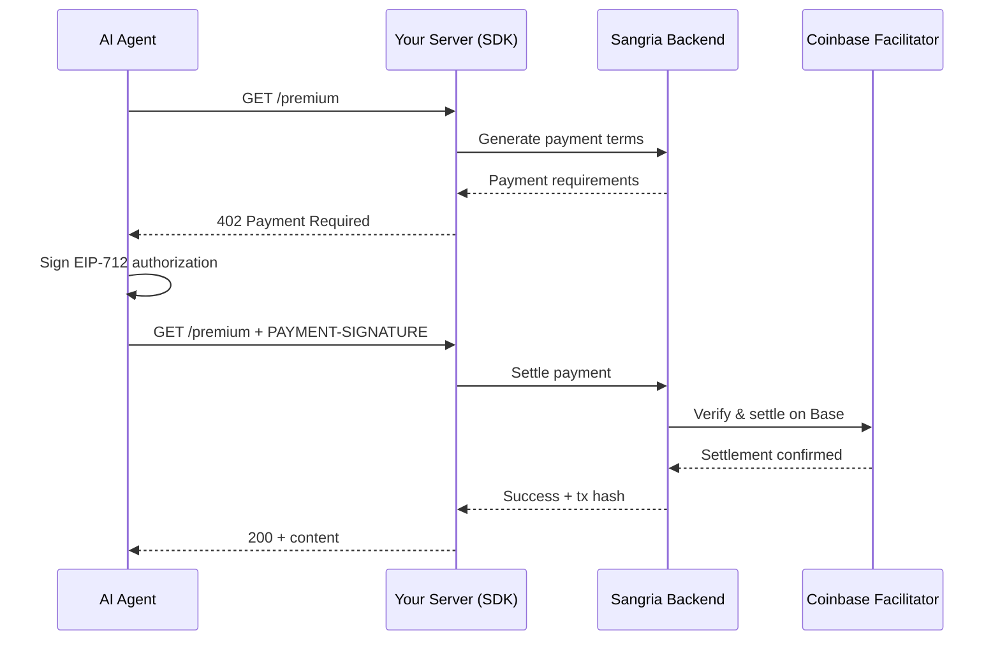

<p align="center">
  
</p>

<p align="center">
  <strong>Let Agents pay for your API (in ~3 lines of code)</strong>
</p>

---

## Quick Start

### TypeScript (Express)

```bash
pnpm add @sangria/core express
```

```typescript
import express from "express";
import { Sangria } from "@sangria/core";
import { fixedPrice } from "@sangria/core/express";

const app = express();
const sangria = new Sangria({ apiKey: process.env.SANGRIA_SECRET_KEY! });

app.get(
  "/premium",
  fixedPrice(sangria, { price: 0.01, description: "Premium content" }),
  (req, res) => {
    res.json({ data: "premium content", tx: req.sangria?.transaction });
  }
);

app.listen(3000);
```

### Python (FastAPI)

```bash
pip install sangria-merchant-sdk[fastapi]
```

```python
from fastapi import FastAPI, Request
from sangria_sdk import SangriaMerchantClient
from sangria_sdk.adapters.fastapi import require_sangria_payment

app = FastAPI()
client = SangriaMerchantClient(api_key=os.environ["SANGRIA_SECRET_KEY"])

@app.get("/premium")
@require_sangria_payment(client, amount=0.01, description="Premium content")
async def premium(request: Request):
    return {"data": "premium content"}
```

**That's it.** Your endpoint now charges $0.01 per request. AI agents pay automatically via the x402 protocol.

---

## Supported Frameworks

| Language   | Framework        | Adapter Import                 |
| ---------- | ---------------- | ------------------------------ |
| TypeScript | Express >= 4     | `@sangria/core/express`        |
| TypeScript | Fastify >= 4     | `@sangria/core/fastify`        |
| TypeScript | Hono >= 4        | `@sangria/core/hono`           |
| Python     | FastAPI >= 0.135 | `sangria_sdk.adapters.fastapi` |

---

## How It Works



---

## Features

- **Zero gas fees** — Coinbase Facilitator sponsors gas on Base
- **Framework agnostic** — Express, Fastify, Hono, and FastAPI with more coming
- **Conditional bypass** — skip payments for API key users with `bypassPaymentIf` / `bypass_if`
- **Fixed & variable pricing** — `exact` and `upto` payment schemes
- **Double-entry ledger** — internal credit system with idempotent transactions
- **Standards-compliant** — EIP-712 typed signing, ERC-3009 USDC transfers, x402 v2

---

## Project Structure

| Directory                                    | What                                               | Stack                           |
| -------------------------------------------- | -------------------------------------------------- | ------------------------------- |
| [`backend/`](backend/)                       | Orchestration API — accounts, payments, settlement | Go, Fiber, pgx                  |
| [`dbSchema/`](dbSchema/)                     | Database schema (single source of truth)           | Drizzle ORM                     |
| [`frontend/`](frontend/)                     | Documentation site                                 | Next.js, Tailwind               |
| [`sdk/sdk-typescript/`](sdk/sdk-typescript/) | TypeScript merchant SDK (`@sangria/core`)          | TypeScript                      |
| [`sdk/python/`](sdk/python/)                 | Python merchant SDK (`sangria-merchant-sdk`)       | Python, httpx                   |
| [`playground/`](playground/)                 | Example merchants + buyer client                   | Express, Fastify, Hono, FastAPI |

---

## Testing

Comprehensive testing suite covering both TypeScript and Python SDKs with 143 tests across security, financial, and end-to-end validation.

### **Quick Commands**

```bash
# Navigate to tests directory
cd tests

# Install dependencies
pnpm install

# Run all tests (143 tests, TypeScript + Python)
pnpm test:all

# Core development tests (TypeScript + Security + Financial)
pnpm test

# By category
pnpm test:unit          # All unit tests (TypeScript + Python)
pnpm test:unit:ts       # TypeScript SDK tests (28 tests)
pnpm test:unit:py       # Python SDK tests (50 tests)
pnpm test:security      # Security tests (33 tests)
pnpm test:financial     # Financial tests (21 tests)
pnpm test:e2e          # End-to-end tests (7 tests)
```

### **What's Tested**

- ✅ **TypeScript SDK**: Core client, payment handling, error management (28 tests)
- ✅ **Python SDK**: Client, models, HTTP handling, FastAPI adapter (50 tests)
- ✅ **Security**: EIP-712 signatures, penetration testing, vulnerability assessment (33 tests)
- ✅ **Financial**: USDC precision, payment lifecycle, compliance validation (21 tests)
- ✅ **End-to-End**: Complete X402 flows, cross-SDK integration (7 tests)
- ✅ **Concurrency**: Race conditions, double-spending prevention, load testing
- ✅ **Database**: Payment persistence, audit trails, state management

### **Test Structure**

```
tests/
├── unit/           # Unit tests for core functionality
│   ├── typescript/ # TypeScript SDK unit tests
│   ├── python/     # Python SDK unit tests
│   ├── crypto/     # Cryptographic validation
│   ├── database/   # Database persistence
│   ├── security/   # Security penetration tests
│   ├── lifecycle/  # Payment lifecycle tests
│   └── concurrency/# Race condition testing
├── security/       # Security-focused test suites
├── financial/      # Financial precision & compliance
├── e2e/           # End-to-end integration tests
└── fixtures/      # Test data and mock responses
```

### **CI/CD Integration**

- **Pull Requests**: Unit + Security + Financial tests with 90%+ coverage
- **Main Branch**: Full test suite including E2E and security audits
- **Multi-language**: TypeScript and Python SDK validation
- **Security**: Dependency vulnerability scanning and penetration testing

---

## Documentation

- [Comprehensive Testing Guide](tests/README.md) — complete testing infrastructure and workflow
- [TypeScript SDK](sdk/sdk-typescript/README.md) — full API, all framework adapters, bypass config
- [Python SDK](sdk/python/README.md) — FastAPI adapter, API contract
- [Playground](playground/README.md) — run example merchants and test payments locally
- [Backend API](backend/README.md) — API reference, self-hosting guide
- [Architecture](Sangria-Architecture.md) — layered architecture deep-dive
- [Protocol Overview](Sangria-Overview.md) — x402 operations and settlement scenarios
